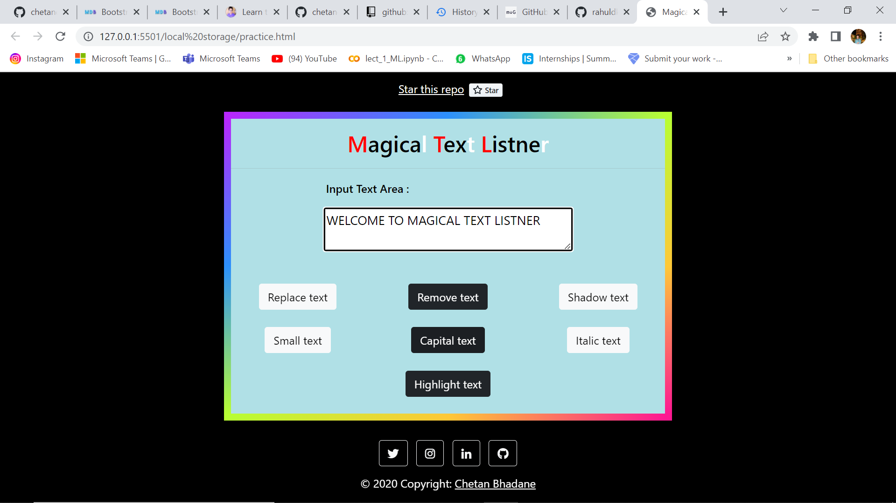
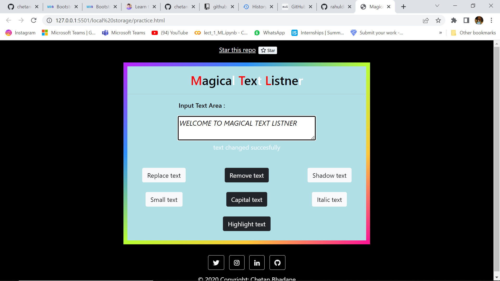
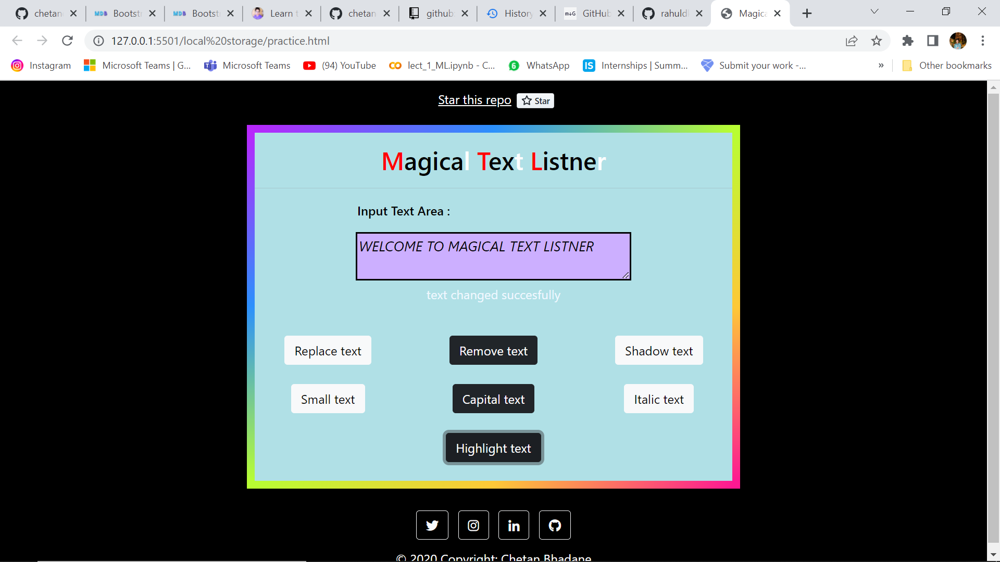

# Magical Text Listner

- This mini project is fully created with javascript and little bit html css with bootstrap responsive.
- Visit here <a href="https://chetandsbhadane.github.io/MagicalTextListner/">Magical Text Listner</a>

# How to use
1. You have to type in the given textarea something.
2. Then you can use this magical text lister with using buttons belonging to it.

# Functionalies
### Button 1 [Replace Text]
Text can be saved in local storage and textarea.

### Button 2 [Remove Text]
Text can be removed from local storage and textarea.

### Button 3 [Shadow Text]
Text will be highlighted with shadow effect.

### Button 4 [Small Text]
Text will be in small case.

### Button 5 [Capital Text]
Text will be in upper case.

### Button 6 [Italic Text]
Text will be in italic form.

### Button 7 [Highlight Text]
Text will be highlighted with the different background colours.

##Screenshots

###Shadow Text

###Capital Text

###Italic text

###Highlighted text

and much more functionalities like small text, save text, remove text etc.
